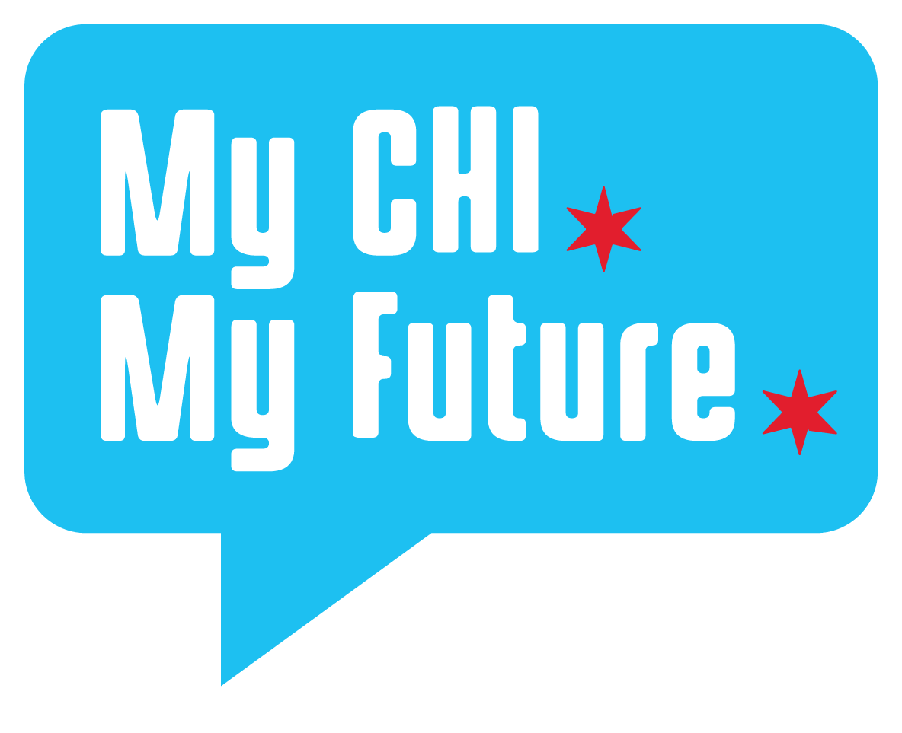

## Understanding Chicago's Social Climate

### Wealth Inequality

Despite being the third largest city, Chicago has persistently been facing significant wealth inequality challenges, which is due to the significant variation in resource allocation. Some communities benefit from robust infrastructure, quality schools, healthcare facilities, and diverse economic opportunities, while others face immense barriers in accessing these resources. Historically marginalized neighborhoods often struggle with limited investment, inadequate public services, and insufficient job opportunities. Such disparities hinder social mobility and perpetuate systemic inequities, ultimately impacting the overall well-being and opportunities available to residents.

It is estimated that a typical household’s wealth in the richest area of Chicago and Cook County is over <strong>200 times</strong> higher than a typical household’s wealth in the poorest areas. This disparity is geographically noticeable. Southern and western regions of Chicago have some of the lowest median net worth and over 40 percent of residents are living below the poverty level. According to the [Chicago Data Portal](https://data.cityofchicago.org/Health-Human-Services/below-poverty-level-by-community/b7zw-zvm2), Riverdale, Fuller Park, Englewood, and West Garfield Park are all areas that have poverty rates above 40 percent and the highest hardship indexes.

### Racial Disparities

Furthermore, Chicago remains one of the most segregated metropolitan area in America. Racial disparities in socio-economic indicators persist, with African American and Hispanic communities often experiencing disproportionately high poverty rates, limited access to quality education, and limited economic opportunities. According to recent [Census](https://www.census.gov/quickfacts/chicagocityillinois) data, the city's population is approximately 33% non-Hispanic white, 29% African American, 29% Hispanic, and 7% Asian American. Despite whites being the minority in Chicago, they are the only group to see incomes rising by 52 percent between 1990 and 2012, compared to just 13 percent for African Americans and 15 percent for Hispanics. Interestingly, African American and Hispanic city residents have seen a fall in per capita incomes since 2000.

This overlapping of racial and income segregation is clear in Chicago. The majority-white census tracts predominantly consist of less than 10 percent of families living in poverty, whereas slightly over half of the majority-black areas experience poverty rates exceeding 30 percent among families. Furthermore, one in four black Americans and one in six Hispanics live in high-poverty neighborhoods, compared to just one in thirteen white Americans. These disparities have a direct impact on the equity of opportunity available to residents in these communities.

### Inequality of Safety

In addition to challenges related to wealth and racial inequality,  Chicago also faces significant challenges in terms of high levels of gun violence and homicide. Although not all communities in Chicago experience the same level of violence, certain neighborhoods, primarily located on the city's South and West sides, face disproportionately high rates of gun violence. These areas are often characterized by high poverty rates, limited access to quality healthcare, inadequate educational resources, and limited economic investment. 

Throughout this century, northern areas of Chicago have consistently been safer with a homicide rate that has declined steadily. Based on data from the Chicago Police Department, the years 2016 and 2020, which were marked by high levels of violence, showed only marginal increases in the homicide rate before it began to decline again in 2021. In the previous year, the homicide rate in Chicago's four North Side police districts (specifically, the 18th, 19th, 20th, and 24th districts) stood at 3.2 residents per 100,000, which was lower than Evanston's.

On the other hand, gun-related homicides in the years 2019 and 2020 were predominantly concentrated in neighborhoods located away from the Loop, primarily neighborhoods in the West and South Sides. Despite the 53 percent increase in Chicago's homicide rate, these communities have endured long-standing disinvestment resulting in concentrated poverty. These areas, largely inhabited by African American residents, bear the brunt of the consequences, experiencing higher rates of gun violence and its associated challenges. The prevalence of gun violence in these communities further exacerbates existing disparities and creates a cycle of lack of resources and economic decline.

## Understanding Accessibility to Chicago's Youth

### Education/job/community$welfare (mentorship)/food

- how many youth don't have phones? access to interrnet?

Educational Inequities: Chicago's public education system has faced challenges related to resource disparities and academic achievement gaps. Historically marginalized communities often have limited access to quality schools, resulting in educational inequities that can perpetuate cycles of poverty and limited opportunities.

specifically for youth? 

### Conclusion

In conclusion, Chicago's communities continue to grapple with deep-rooted challenges related to wealth inequality, racial disparities, and gun violence. The city's wealth disparity is evident in the vast differences in resource allocation and access to opportunities between affluent areas and economically disadvantaged neighborhoods. Racial disparities persist, with African American and Hispanic communities facing higher poverty rates and limited economic mobility. The overlap of racial and income segregation further exacerbates inequities and limits opportunities for residents in marginalized communities.

Gun violence remains a significant issue, primarily concentrated in the city's southern and western regions. These areas, marked by historical disinvestment and concentrated poverty, experience higher rates of homicides and shootings. The prevalence of gun violence perpetuates the cycle of lack of resources, limited access to quality education and healthcare, and economic decline, exacerbating the existing disparities.

Addressing these complex challenges requires a multifaceted approach that focuses on equitable resource distribution, targeted interventions in disadvantaged neighborhoods, and comprehensive strategies to combat systemic inequities. Efforts should aim to create inclusive and safe communities, improve educational opportunities, promote economic development, and address the root causes of violence and inequality. By prioritizing equity, Chicago can strive towards a more just and inclusive city that provides equal opportunities for all its residents.

## Additional Resouces

### Chicago Public Schools' Annual Regional Analysis (ARA)

The ARA data provides valuable insights into the academic performance of students in the Chicago Public School (CPS) system and helps identify areas where additional support or interventions may be needed. Its purpose is to support CPS’s goal of providing every student with high-quality education in every neighborhood by giving stakeholders a consistent array of information regarding school quality, enrollment patterns, school choice, and program offerings by region. The goal is to ensure that every student in Chicago has access to quality public schools and a variety of schools and programs.
The report includes information on all CPS schools, including traditional neighborhood, Selective Enrollment, Magnet, Charter, Special Education Specialty, and other alternative high schools.

